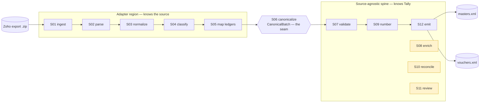

<div align="center">

# 📒 TallyImporter

### Turn an accounting export into a verified TallyPrime import — deterministically.

**Zoho Books export `.zip` → `masters.xml` + `vouchers.xml` that TallyPrime accepts.**


</div>

---

## ✨ What it does

TallyImporter reads a source accounting system's export and produces **import-ready
TallyPrime XML** — both the **ledgers** (masters) and the **transactions** (vouchers) a
fresh Tally company needs. It is built as a **12-stage pipeline** around one
**source-agnostic canonical model**, so the messy, source-specific work is confined to
the front of the line and everything downstream is clean, typed, and reusable.

> ✅ **Proven against a real TallyPrime instance** (cross-device): the generated files
> imported with **zero errors** and round-tripped faithfully — 998 ledgers and
> 10,200 vouchers from the Zoho sample export.

## 🏎️ Quickstart

```bash
# 1. environment (Python 3.12) — conda OR venv; see docs/RUNNING.md
conda create -n tallyimporter python=3.12 -y && conda activate tallyimporter

# 2. install
pip install -e .

# 3. run  (one line; on Windows cmd do NOT use backslash line-breaks)
tallyimporter path/to/Zoho_books_data.zip --company "Your Co" --date 20260401 --out ./out
```

Then in TallyPrime: **Import → Masters** (`out/masters.xml`) **then Import → Vouchers**
(`out/vouchers.xml`). Full setup for conda **and** venv is in **[`docs/RUNNING.md`](docs/RUNNING.md)**.

<details>
<summary>Use it as a library</summary>

```python
from datetime import date
from tallyimporter.pipeline import run_pipeline_full

with open("Zoho_books_data.zip", "rb") as f:
    export = run_pipeline_full(f.read(), company_name="Your Co", posting_date=date(2026, 4, 1))

open("masters.xml", "wb").write(export.masters_xml)
open("vouchers.xml", "wb").write(export.vouchers_xml)
```
`run_pipeline_full(...)` also accepts `enrich=True` (bill-wise allocations) and
`prior=<PriorImportState>` (skip already-imported vouchers).
</details>

## 🗺️ How it works (the engine)



Everything **left of the seam** may know about Zoho; everything **right of it** only
knows the Tally contract. A future *Busy* adapter would replace the front, reuse the rest.

👉 **A full step-by-step walkthrough of every stage (with a worked example) is in
[`docs/ENGINE.md`](docs/ENGINE.md).**

### The 12 stages

| # | Stage | Does | In → Out |
|---|-------|------|----------|
| S01 | **ingest** | unzip into role-tagged immutable bytes | `bytes` → `IngestedArchive` |
| S02 | **parse** | CSV → tables; validate joins, dup ids, structure | → `SourceDataset` |
| S03 | **normalize** | clean values; amounts → exact `Decimal` | → `SourceDataset` |
| S04 | **classify** | pick the Tally voucher type + confidence | → `ClassifiedTxn[]` |
| S05 | **map ledgers** | resolve every account to a Tally ledger name | → `MappedTxn[]` |
| S06 | **canonicalize** | build the balanced double-entry `CanonicalBatch` | → `CanonicalBatch` |
| S07 | **validate** | business rules → typed report (block on errors) | → `ValidationReport` |
| S08 | **enrich** *(opt)* | bill-wise allocations + party ledger | → `EnrichedBatch` |
| S09 | **number** | guarantee unique voucher numbers | → `NumberedBatch` |
| S10 | **reconcile** *(opt)* | drop vouchers already imported | → `ReconciliationResult` |
| S11 | **review** *(opt)* | gate low-confidence vouchers for a human | → `ReviewQueue` |
| S12 | **emit** | map → serialize (lxml) → validate XML | → `masters.xml` + `vouchers.xml` |

## 🔒 The Tally contract (why the output is trustworthy)

The output target is a **verified contract** (`PHASE_1_BUILD.md` §2), grounded in Tally's
official docs and then **confirmed by importing into real TallyPrime**:

- Voucher envelope shape, header, element order — fixed and validated.
- **Sign convention:** debit → `ISDEEMEDPOSITIVE=Yes` + negative `AMOUNT`; credit → `No` +
  positive; signed amounts in a voucher **sum to exactly 0** (`Decimal`).
- Dates `YYYYMMDD`; 2-dp money (round-half-up at the boundary only); XML auto-escaped.
- Unique voucher numbers; minimal `LEDGER` masters (`NAME.LIST` / `PARENT` / `ACTION`) —
  Tally auto-fills the rest (confirmed by round-trip).

Every generated file passes a structural validator (`validate_tally_xml` /
`validate_masters_xml`) **and** we read Tally's response back with `parse_import_result`
(UTF-16 + recovering parser). The round-trip findings live in
[`smoke_import/ROUNDTRIP_FINDINGS.md`](smoke_import/ROUNDTRIP_FINDINGS.md).

## 🧭 Design principles (enforced, not aspirational)

| Principle | How it's guaranteed |
|---|---|
| **Pure core / imperative shell** | Stages are pure functions of typed models; only CLI/ingest touch the filesystem. |
| **Typed, frozen boundaries** | Every model is Pydantic v2 `frozen=True, extra="forbid"`. |
| **Fail loud** | Bad input raises a typed `StageError` (never silent coercion/drops). |
| **Deterministic** | Same input → byte-identical output (stable ordering; no clocks/RNG). |
| **Decimal money** | `Decimal` everywhere; a `float` in a money path is a defect. |
| **Source-agnostic** | Source knowledge stops at the canonical seam; enforced by **import-linter**. |
| **Single responsibility** | One job per stage; stages never import one another. |

## 📦 Project layout

```
src/tallyimporter/
├─ contracts/        # the frozen spine: canonical · tally · source · validation · errors
├─ core/             # money.py (Decimal helpers)
├─ profiles/         # zoho.py — the Zoho source profile (all source knowledge, as data)
├─ stages/           # s01_ingest … s12_emit  (pure, single-responsibility)
├─ pipeline.py       # the orchestrator (imperative shell)
└─ cli.py            # the `tallyimporter` command
docs/                # RUNNING.md · ENGINE.md · build_sheets/ · CONTRACT_EXTENSIONS_PHASE2.md
smoke_import/        # manual TallyPrime QA kit + round-trip findings
tests/               # unit · golden · property  (149 tests)
```

## 📚 Documentation map

| Doc | For |
|-----|-----|
| **[`docs/RUNNING.md`](docs/RUNNING.md)** | Install & run (conda + venv, all OSes) |
| **[`docs/ENGINE.md`](docs/ENGINE.md)** | Step-by-step engine walkthrough + worked example |
| **[`docs/build_sheets/`](docs/build_sheets/)** | Per-stage design specs (S01–S12) + cross-cutting decisions |
| **[`PHASE_1_BUILD.md`](PHASE_1_BUILD.md)** | The verified §2 Tally XML contract |
| **[`smoke_import/`](smoke_import/)** | Real-Tally smoke kit + round-trip findings |
| **[`docs/CONTRACT_EXTENSIONS_PHASE2.md`](docs/CONTRACT_EXTENSIONS_PHASE2.md)** | Bill allocations / party / reconcile / review design |

## ✅ Quality gate

```bash
make check      # ruff (lint+format) · mypy --strict · import-linter · pytest (≥90% cov)
```

## 🛣️ Status

All 12 stages implemented; `make check` green (**149 tests, ~96% coverage**). The default
pipeline (S01→S07→S09→S12) is validated against real TallyPrime; S08/S10 are opt-in, S11
is a human gate. Deferred by design: statutory GST metadata (HSN/rate) and additional
source adapters (e.g. Busy) — the architecture already accommodates them.
